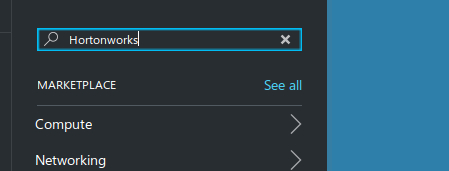
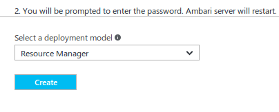
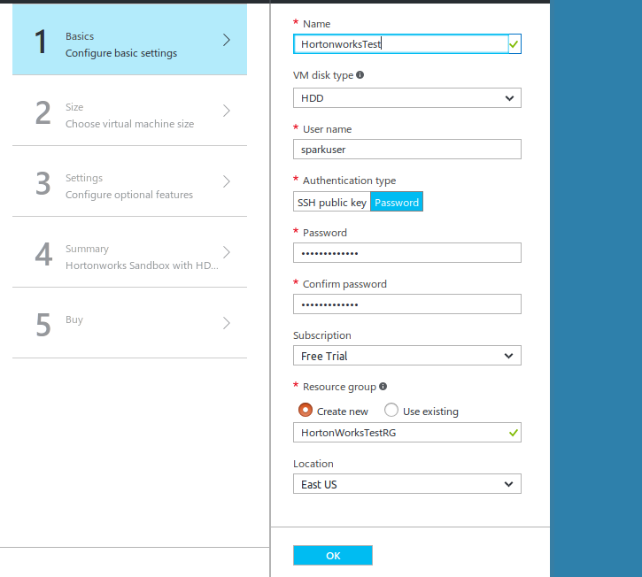
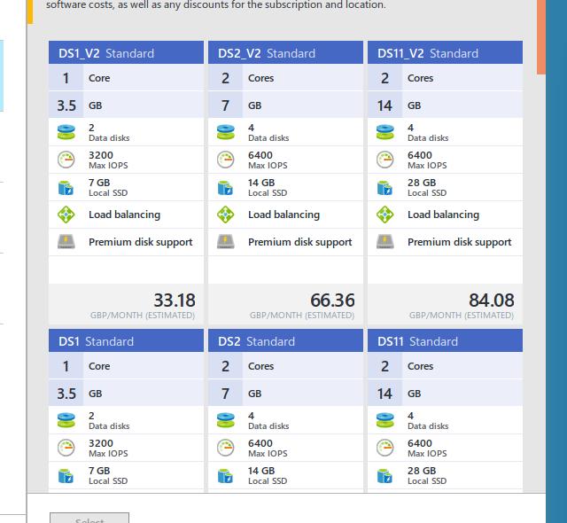
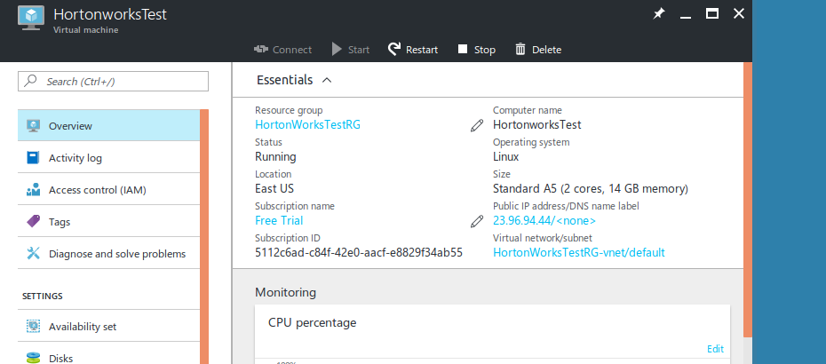

# Practical 1: Creating a Virtual Machine

## Objectives
In this first practical lab, we will:

  * Explore the Azure portal
  * Create a Virtual Machine
  * Install and configure the Hortonworks Sandbox
  * Test it works via a Web browser
  * Confirm access to the Zeppelin Notebook server

### Exercise 1: Creating the VM

Access the Azure portal at: http://portal.azure.com and sign in using the account details you have configured with your promotional code.

We are going to create a virtual machine based on a template- the Hortonworks Sandbox. This will preconfigure a Linux virtual machine, Apache Hadoop and Apache Spark big data tools and a range of other components including **Zeppelin Notebook** which makes interacting with Spark quite straightforward.

To create a Virtual Machine, follow these steps:

1.From the portal, click **[+ NEW]** then choose **Search the marketplace** and then enter **Hortonworks Sandbox**:

\ 

\ 

2.At the next screen, you will be prompted to choose the correct Hortonworks template. Select **Hortonworks Sandbox with HDP 2.4**

\ 

and at the bottom right hand of the page, choose **Resource Manager** from the *Select a deployment model* section.

\ 

3.At the next screen you will start the configuration process :

On **Tab 1: Basics**

\ 

You will need to:

  * enter a suitable name for the sandbox
  * change **VM disk type** to SSD (it's a bit cheaper)
  * set username to **sparkuser** and enter a suitable password
  * make sure that you select **Create New** in the Resource group section and give it a suitable name
  * Click **[OK]**

**Make sure you remember the username and password. Keep them somewhere safe**

On **tab 2: Size**

\ 

Choose the option **DS2_V2 standard** and click **[Select]** 

Finally, on **tab 5: Buy** click **[Purchase]**. All the options are covered by your credits.

5.The final screen will start to create your VM. The process usually takes around 5 minutes.

After the process has completed, you will be presented with a confirmation screen like this one:

\ 

Make sure you note the **Public IP address**. You will need this to access features of the Hortonworks Sandbox.

### Exercise 2: Logging into the Zeppelin Notebook for the first time

After the VM has been created, it will have been given a unique IP address. 

For example, if your ip address is **123.12.121.14**

You can access your Zeppelin Notebook through your browser at **http://123.12.121.14:9995**
