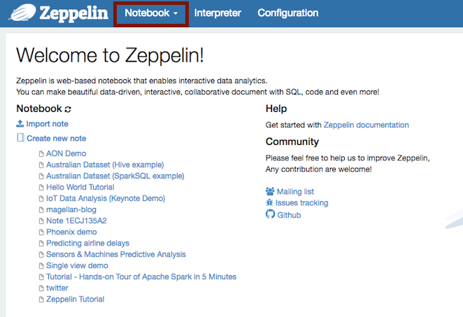
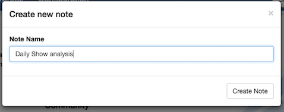
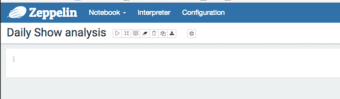
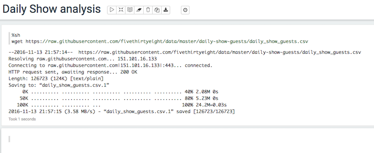

# Practical 2: Using Pyspark to analyse data using Apache Spark

Spark is an increasingly popular cluster computing system based on Apache Hadoop that offers great potential value because of its speed and ease of use. We are going to have a look at it here, with special focus on the Python interface to Spark: PySpark.

Other useful information that is helpful as a resource that can be used throughout this tutorial:
http://spark.apache.org/docs/2.1.0/api/python/pyspark.html 

## Instructions to start Spark's service within Ambari as admin

We must first, setup your admin access to Ambari. We must go to port 8888, there we will have a view of the Hortonworks get started page. On this page select "View Advanced Options" (orange box on the right hand side of the webpage). Below there is a set of instructions to setup the Ambari admin password. Login as root using Putty and follow those set of instructions. Once you have changed the password, Ambari will be restarted. Even though Ambari says it started successfully, it can take a little bit longer to start up fully. Once Ambari has started go to port 8080 and enter your admin as your username and type in the password you chose, then select "Sign in".

Now we have done the above, we can now start Spark's service, which will be demonstrated by your tutor.

## Spark Initialization: Spark Context

A Spark cluster consists of two processes, a driver program and multiple workers nodes each running an executor process. The driver program runs on the driver machine, the worker program runs on cluster nodes or on local threads. The first thing a program does is to create a Spark context object, this tell Spark HOW and WHERE to access a cluster. SparkContext is the object that manages the connection to the clusters in Spark and coordinates running processes on the clusters themselves. A Spark context connects to the Cluster Manager. The Cluster Manager allocates resources across applications. Once connected Spark acquires executors and the worker nodes. An Executor is a process that runs computations and stores data for your application. JAR or Python files pass to the Spark Context and then sent to the Executors. Spark context will send the tasks for the Executor to run. The worker nodes can access data storage sources to ingest and output data as needed. Here’s a diagram from the Spark documentation to better visualize the architecture:

The SparkContext object is usually referenced as the variable sc. We then run:

#### Example (do not run it)
~~~
raw_data = sc.textFile("daily_show.tsv")
~~~
to read the TSV dataset into an RDD object raw_data. The RDD object raw_data closely resembles a List of String objects, one object for each line in the dataset. We then use the take() method to print the first 5 elements of the RDD:

#### Example (do not run it)
~~~
raw_data.take(5)
~~~
To explore the other methods an RDD object has access to, check out the PySpark documentation. take(n) will return the first n elements of the RDD.

## Exercise 1: Map/Reduce

The map() transformation takes in a function and applies it to each element in the RDD with the result of the function being the new value of each element in the resulting RDD. We can use map() to do any number of things, from fetching the website associated
with each URL in our collection to just squaring the numbers. It is useful to note that map()’s return type does not have to be the same as its input type, so if we had an RDD String and our map() function were to parse the strings and return a Double, our input RDD type would be RDD[String] and the resulting RDD type would be RDD[Double].

By using the map transformation in Spark, we can apply a function to every element in our RDD. Python's lambdas are specially expressive for this particular.

Let’s start with a map example, but first we must launch **Apache Zeppelin**. This provides an online interactive Data Science notebook which uses the Python programming language in the background. If the IP address of your instance is (for example: `192.168.214.131`, you'll find your notebook at web address: `http://192.168.214.131:9995`

You should see something like this:

\ 

Once you have launched Apache Zeppelin, you are required to create a "Notebook". From the Notebook drop-down select *Create new note+* and give the new notebook a suitable name and then select "Create Note".  

Now we can focus back on the task at hand. The goal of the map example below is to convert temperature from Celcius to Kelvin. Here below shows how it translates in PySpark. 

~~~
%pyspark
temp_c = [10, 3, -5, 25, 1, 9, 29, -10, 5]
rdd_temp_c = sc.parallelize(temp_c)
rdd_temp_K = rdd_temp_c.map(lambda x: x + 273.15).collect()
print(rdd_temp_K)   
~~~

Write the script below in your note and inspect the result. You will recognize the map function (please note it is not the pure python map function but PySpark map function). It acts here as the transformation function while collect is the action. It pulls all elements of the RDD to the driver. This can be useful if your program filters RDDs down to a very small size and you’d like to deal with it locally. 

#### More common transformations and actions supported by Spark with explanation of they mean:
http://spark.apache.org/docs/latest/programming-guide.html#transformations (List of transformations, such as map())
http://spark.apache.org/docs/latest/programming-guide.html#actions (List of actions, such as collect())

#### Remark:

Keep in mind that your entire dataset must fit in memory on a single machine to use collect() on it, so collect() shouldn’t be used on large datasets. It is often a very bad idea to pull all the elements of the RDD to the driver because we potentially handle very large amount of data. So instead we prefer to use take as you can specify how many elements you wish to pull from the RDD.

For instance to pull the first 3 elements only:

~~~
%pyspark
temp_c = [10, 3, -5, 25, 1, 9, 29, -10, 5]
rdd_temp_c = sc.parallelize(temp_c)
rdd_temp_K = rdd_temp_c.map(lambda x: x + 273.15).take(3)
print(rdd_temp_K)   
~~~

#### Now let’s take another example where we use map as the transformation and reduce for the action.
~~~
# we define a list of integers
numbers = [1, 4, 6, 2, 9, 10]

rdd_numbers=sc.parallelize(numbers)

# Use reduce to combine numbers
rdd_reduce = rdd_numbers.reduce(lambda x,y: "(" + str(x) + ", " + str(y) + ")")
print(rdd_reduce)
~~~

reduce() require that the return type of our result be the same type as that of the elements in the RDD we are operating over.

## Exercise 2: Create RDD from a file & explore the data 

In these exercises, we'll be using some example data from the **Five Thirty Eight** project. 538 publish articles based on the analysis of polling and other data and make many of the datasets they use available for further analysis.

Website: [http://fivethirtyeight.com/](http://fivethirtyeight.com/)

Data repository: [https://github.com/fivethirtyeight/data](https://github.com/fivethirtyeight/data)

In these exercises, we will be using the *Daily Show Guests* dataset, but you can do these exercises with any of the datasets you find useful or interesting.

First, download the `daily_show_guests.csv` file to your PC. Take a look at at and get a feel for the nature of the data it contains.

This should open up in your Spreadsheet application as it's a `csv` comma-separated variable file. This isn't a particularly large dataset, but it's large enough to demonstrate some important principles.

In your HortonWorks VM, create a new note within **Apache Zeppelin**. From the Notebook drop-down select *Create new note+* and give the new notebook a suitable name:

You should get a new blank notebook:

\ 

## First steps with analysis

We need to get data using the 'Shell' interpreter. This will download the dataset into the Virtual Machine you created earlier:

Enter this code into the first blank section (we call these *paragraphs*) in the notebook.

~~~
%sh
wget https://raw.githubusercontent.com/fivethirtyeight/data/master/daily-show-guests/daily_show_guests.csv
~~~

Like this:

\ 

Hit [SHIFT] and [ENTER] and you'll see:

~~~
--2016-11-13 20:01:09--  https://raw.githubusercontent.com/fivethirtyeight/data/master/daily-show-guests/daily_show_guests.csv
Resolving raw.githubusercontent.com... 151.101.60.133
Connecting to raw.githubusercontent.com|151.101.60.133|:443... connected.
HTTP request sent, awaiting response... 200 OK
Length: 126723 (124K) [text/plain]
Saving to: “daily_show_guests.csv.1”
     0K .......... .......... .......... .......... .......... 40% 3.48M 0s
    50K .......... .......... .......... .......... .......... 80% 4.38M 0s
   100K .......... .......... ...                             100% 14.1M=0.03s
2016-11-13 20:01:10 (4.50 MB/s) - “daily_show_guests.csv.1” saved [126723/126723]
FINISHED   
~~~

Spark stores it's data in **Resilient Distributed datasets** (or RDDs for short), but first we need to get the data from the disk into HDFS, the **Hadoop Distributed File System** in our Virtual machine.
 
~~~
%sh
hadoop fs -put ~/daily_show_guests.csv /tmp
~~~

This will `put` the file we have just downloaded into the directory `tmp` within the HDFS.

If you make a mistake during this step or you put the wrong file in the HDFS, you can delete it by:

~~~
%sh
hdfs dfs -rm -r hdfs://sandbox.hortonworks.com/tmp/daily_show_guests.csv
~~~

 ##### Next, to read a CSV file called "daily_show_guests.csv" into an RDD object called "my_rdd", we'll be using the *PySpark* Python interpreter, so we'll need to tell the Zeppelin notebook this by prefixing the command with `%pyspark`:

~~~
%pyspark
my_rdd = sc.textFile('hdfs://sandbox.hortonworks.com/tmp/daily_show_guests.csv')
~~~

We refer to the HDFS within this Sandbox as `hdfs://sandbox.hortonworks.com`. It's not a web address.

This 'filter' transformation applied (below) to RDDs in order to keep just elements that satisfy a certain condition. More concretely, a function is evaluated on every element in the original RDD. The new resulting RDD will contain just those elements that make the function return True. Let's make sure the data has been loaded into the `RDD` we called `my_rdd` by counting how many lines there are:

~~~
%pyspark
my_rdd = sc.textFile('hdfs://sandbox.hortonworks.com/tmp/daily_show_guests.csv')
my_rdd_filtered = my_rdd.filter( lambda x: len(x) > 0 )
counter = my_rdd_filtered.count()
print (counter)
~~~

It should return `2694` rows.

At this stage, these are just long rows of text and not split into the individual fields. If you recall, the fields are:

Header | Definition
-------|-----------
`YEAR` | The year the episode aired
`GoogleKnowlege_Occupation` | Their occupation or office, according to Google's Knowledge Graph or, 
if they're not in there, how Stewart introduced them on 
the program.
`Show` | Air date of episode. Not unique, as some shows had more than one guest
`Group` | A larger group designation for the occupation. For instance, us senators, us presidents, 
and former presidents are all under "politicians"
`Raw_Guest_List` | The person or list of people who appeared on the show, according to Wikipedia. 
The GoogleKnowlege_Occupation only refers to one of them in a given row. 

The RDD object my_rdd closely resembles a List of String objects, one object for each line in the dataset. We then use the take() method to print the first 5 elements of the RDD, so take a look at the first 5 rows of the RDD we just created:

~~~
%pyspark
print (my_rdd.take(5))
~~~

You'll note that the first row is a header row, but this is a bit of a mixed up format. It will make it much easier for us if we can turn each line into a LIST of other items. This will make it more straightforward to handle in Python.

To do this:

~~~
%pyspark
daily_show = my_rdd.map(lambda line: line.split(','))
~~~

and now:

~~~
%pyspark
print (daily_show.take(5))
~~~

will show:

~~~
[[u'YEAR', u'GoogleKnowlege_Occupation', u'Show', u'Group', u'Raw_Guest_List'], 
[u'1999', u'actor', u'1/11/99', u'Acting', u'Michael J. Fox'], 
[u'1999', u'Comedian', u'1/12/99', u'Comedy', u'Sandra Bernhard'], 
[u'1999', u'television actress', u'1/13/99', u'Acting', u'Tracey Ullman'], 
[u'1999', u'film actress', u'1/14/99', u'Acting', u'Gillian Anderson']]

~~~

Note the [SQUARE BRACKETS] around each line. This is a list. Each line is now a list of strings (Don't worry about the `u`- that just means they are stored in Unicode format).

To recap then, we:

1. Called the RDD function `map()` to specify we want the expression in the brackets to be applied to every line in our dataset 
2. Wrote a **lambda function** fig to split each line using the comma delimiter "," and assigned the resulting RDD to `daily_show`. In Python, a lambda function is just a small self-contained function or expression.
3. Called the RDD function `take()` on `daily_show` to display the first 5 rows of the resulting RDD 

Let's try something a bit more relevant. We need a tally (or simple histogram) of the number of guests each year in our dataset.

First, do this:

~~~
%pyspark
guest_tally = daily_show.map(lambda x: (x[0], 1)).reduceByKey(lambda x,y: x+y)
~~~

This uses both a `map()` and a `reduce()` function to create the tally.

The map part: `.map(lambda x: (x[0], 1))` goes down every row and creates a *tuple* (a key - value pair) consisting of the year and a value 1.

The reduce part: `reduceByKey(lambda x,y: x+y)` combines together all the tuples with the same key using the `x + y` function, ie. it adds them together.

Taking a look at the final results:

~~~
%pyspark
print (guest_tally.take(guest_tally.count()))
~~~

We see the resulting list of key-value pairs:

~~~
[(u'1999', 166), (u'2002', 159), (u'2000', 169), (u'2006', 161), (u'2004', 164), 
(u'2015', 100), (u'2008', 164), (u'2011', 163), (u'2013', 166), (u'2005', 162), 
(u'2003', 166), (u'2001', 157), (u'2007', 141), (u'YEAR', 1), (u'2014', 163), 
(u'2009', 163), (u'2010', 165), (u'2012', 164)]
FINISHED   
~~~

Unfortunately, Spark doesn't know how to handle the column headings so the element `(u'YEAR', 1)` needs to be removed.

Spark has a useful function called `filter` that allows us to create a new RDD from an existing one that contains only the elements we specify. We can create a function in Python that will skip over the line that contains `YEAR`. In the example below we refer to the first element of each line as `line[0]` because Python starts its element numbering at 0. The second element would be `line[1]` etc.

~~~
%pyspark
def filter_out_year(line):
    if line[0] == 'YEAR':
        return False
    else:
        return True
        
cleaned_daily_show = guest_tally.filter (lambda line: filter_out_year(line))

print (cleaned_daily_show.take(guest_tally.count()))

~~~

Will now result in the complete tally of years and numbers of guests per year:

~~~
[(u'1999', 166), (u'2002', 159), (u'2000', 169), (u'2006', 161), (u'2004', 164), (u'2015', 100), (u'2008', 164), (u'2011', 163), (u'2013', 166), (u'2005', 162), (u'2003', 166), (u'2001', 157), (u'2007', 141), (u'2014', 163), (u'2009', 163), (u'2010', 165), (u'2012', 164)]
~~~
## Chaining

To flex Spark’s muscles, we’ll demonstrate how to chain together a series of data transformations into a pipeline and observe Spark managing everything in the background. Spark was written with this functionality in mind and is highly optimized for running tasks in succession. Previously, running lots of tasks in succession in Hadoop was incredibly time consuming since intermediate results needed to be written to disk and Hadoop wasn’t aware of the full pipeline.

Thanks to Spark’s aggressive usage of memory (and only disk as a backup and for specific tasks) and well architected core, Spark is able to improve significantly on Hadoop’s turnaround time. In the following code block, we’ll filter out actors with no profession listed, lowercase each profession, generate a histogram of professions, and output the first 5 tuples in the histogram.
~~~
cleaned_daily_show.filter(lambda line: line[1] != '') \
                   .map(lambda line: (line[1].lower(), 1)) \
                   .reduceByKey(lambda x,y: x+y) \
                   .take(5)
~~~

~~~
[('radio personality', 3),
 ('television writer', 1),
 ('american political figure', 2),
 ('former united states secretary of state', 6),
 ('mathematician', 1)]
~~~

#### Once you have completed the above tasks refer to the documentation below, and try using other TRANSFORMATIONS and ACTIONS on the Daily Show Guests data.

## The Spark universe

### Other interesting tools for Spark:

Spark SQL: http://spark.apache.org/docs/latest/sql-programming-guide.html
MLlib, Spark's machine learning library: http://spark.apache.org/docs/latest/mllib-guide.html
Spark Streaming, for streaming data applications: http://spark.apache.org/docs/latest/streaming-programming-guide.html  
Also, check out Spark streaming with Twitter data: https://www.zeppelinhub.com/viewer/notebooks/aHR0cHM6Ly9yYXcuZ2l0aHVidXNlcmNvbnRlbnQuY29tL2hvcnRvbndvcmtzLWdhbGxlcnkvemVwcGVsaW4tbm90ZWJvb2tzL21hc3Rlci8yQjUyMlYzWDgvbm90ZS5qc29u 

Other notebook examples: https://github.com/hortonworks-gallery/zeppelin-notebooks

## More information

### Documentation

Spark documentation: https://spark.apache.org/docs/latest/index.html
Spark programming guide: http://spark.apache.org/docs/latest/programming-guide.html
PySpark documentation: https://spark.apache.org/docs/latest/api/python/index.html
Spark examples (Python): http://spark.apache.org/examples.html
Setup Spark - http://mbonaci.github.io/mbo-spark/

### Books
Learning Spark: http://shop.oreilly.com/product/0636920028512.do
(preview: https://www.safaribooksonline.com/library/view/learning-spark/9781449359034/)

## Talks (recommended to watch them in this order)

Parallel programming with Spark: https://www.youtube.com/watch?v=7k4yDKBYOcw

Advanced Spark features: https://www.youtube.com/watch?v=w0Tisli7zn4

PySpark: Python API for Spark: https://www.youtube.com/watch?v=xc7Lc8RA8wE

Understanding Spark performance: https://www.youtube.com/watch?v=NXp3oJHNM7E

A deeper understanding of Spark's internals: https://www.youtube.com/watch?v=dmL0N3qfSc8
